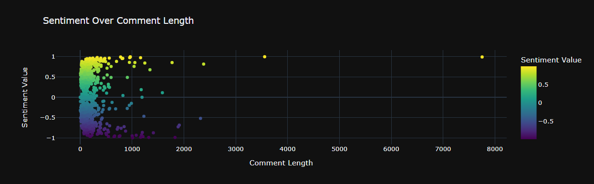

# YouTube Video Transcript Analyzer 

Welcome to the **DataViz-YT_API_LexCIA_VideoIntel** repository. This repository contains a Python-based data science project that leverages the YouTube Data API and the YouTube Transcript API for extracting, analyzing, and visualizing YouTube video transcript and comment data. 

## Description

The main purpose of this project is to derive insights from YouTube video transcripts using Natural Language Processing (NLP) techniques and machine learning algorithms. The project contains several key features:

1. **Caption Extraction**: Retrieves both automatic and manual captions of a YouTube video.
2. **Transcript Extraction**: Generates the transcript of a YouTube video.
3. **Transcript Preprocessing**: Performs text cleaning and preprocessing on the transcripts.
4. **Data Analysis**: Conducts various types of analyses such as word frequency analysis, topic distribution, sentiment analysis, speaker contribution analysis, and named entity recognition.
5. **Data Visualization**: Creates informative visualizations to better understand the derived insights.
6. **Topic Modeling**: Implements Latent Dirichlet Allocation (LDA) for classifying text in a document to a specific topic.

---
## Visualizations

Here are some of the visualizations generated by this project:

### Reddit Comment Length vs Sentiment Comparison


### Sentiment Distribution in Reddit Comments


### Top 20 Keywords in Reddit Comments


### Top 20 Most Frequent Words


### Top Keywords


### Top Named Entities


### Topic Distribution


### Topic Duration


### Word Cloud of Frequent Words


### YouTube Comment Enhanced Sentiment Score Frequency


### YouTube Comment Length by Sentiment


### YouTube Comment Length Frequency Comparison


### YouTube Comment Length vs Sentiment Comparison


### YouTube Comment Length vs Sentiment Score


### YouTube Comment Sentiment Score Frequency


### YouTube Comments Sentiment Scores with Mood Representative Colors


### YouTube Comments Word Cloud


---

## Installation

To install the necessary dependencies for this project, run the following command:

```bash
pip install youtube_transcript_api requests json nltk spacy gensim pyLDAvis plotly
```
## Usage

To use this project, upload the Jupyter notebook to your Jupyter Notebook environment or any IDE that supports .ipynb files. Ensure you have a valid YouTube Data API key for extracting video captions.

## Contributing

This repository is open-source. We warmly welcome contributions to enhance the functionality and efficiency of the code. If you're interested in contributing, please open an issue first to discuss the proposed changes.

## Visibility

This repository is set to **Private**. Only chosen collaborators can view and commit to this repository.

## License

The license for this project hasn't been defined yet. Refer to the **License** section to understand permissions regarding this code.

## Additional Files

This repository is initialized with a README and a .gitignore file. The .gitignore file specifies which file or file types Git should disregard. Check it for a list of ignored files.

For a comprehensive understanding of the project, we recommend going through the Jupyter notebook file.

---

Created by the ML-YouTubeTranscriptAnalyzer team.
